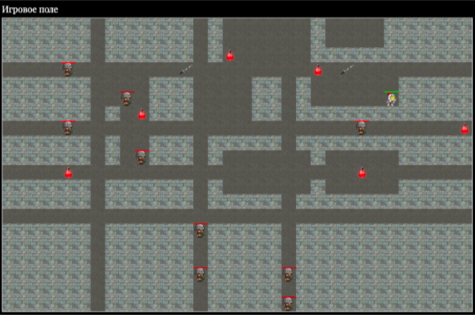

Тестовое задание в Easy Merch

# О тестовом

Пошаговая Игра “РОГАЛИК” на JavaScript (Желательно использовать JS5).

Можно сделать не всю игру, при оценке тестового задания будет учитываться степень проработки.
`Архив` с html, css, jquery и картинками был прикреплён к документу google documents.

# Задание

## Вы можете скачать себе файл и отмечать здесь выполнение пунктов для удобства контроля выполнения:

1. [x] Сгенерировать случайную карту
2. [x] Залить всю карту стеной
3. [x] Разместить случайное количество (5 - 10) прямоугольных “комнат” со случайными размерами (3 - 8 клеток в длину и ширину)
4. [x] Разместить случайное количество (3 - 5 по каждому направлению) вертикальных и горизонтальных проходов шириной в 1 клетку
5. [x] Разместить мечи (2 шт) и зелья здоровья (10 шт) в пустых местах
6. [x] Поместить героя в случайное пустое место
7. [x] Поместить 10 противников с случайные пустые места
8. [x] Сделать возможность передвижения героя клавишами WASD (влево-вверх-вниз-вправо)
9. [ ] Сделать возможность атаки клавишей пробел ВСЕХ противников находящихся на соседних клетках
10. [ ] Сделать атаку героя противником, если герой находится на соседней клетке с противником
11. [x] Сделать случайное передвижение противников (на выбор, либо передвижение по одной случайной оси, либо случайное направление каждый ход, либо поиск и атака героя)
12. [ ] Сделать восстановление здоровья при наступлении героя на зелье здоровья (и удаление зелья)
13. [ ] Сделать увеличение силы удара героя при наступлении героя на меч (и удаление меча)

Можете сделать еще что-то на ваш выбор

## Финальный результат, который должен получиться

# Моё решение

1. Express сервер с выдачей статики, так-же используется parcel-bunlder для компиляции ts кода, используемого страницей
2. ( пока не выполнено ) Докер контейнер
