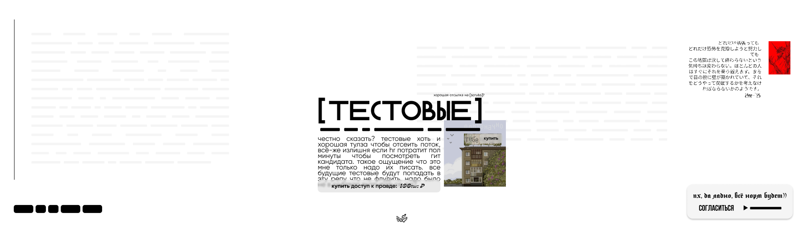

# Тестовые задания (сборка)

> Раньше каждое тестовое тестовое было в отдельном репозитории. С помощью скрипта я собрал все тестовые в одном репозитории. Из минусов это слитые коммиты в одну ветку, но можно отслеживать commit history отдельных файлов. Будущие тестовые будут (на время) храниться в отдельных репозиториях с последующим переносом в этот репозиторий.

### Напоминалка себе

1. `chmod +x repo.sh` если не прописан уже
2. `./repo.sh --repo=https://github.com/ник/репозиторий.git` (вставить свою ссылку, в .sh файле есть gpt комменты)
