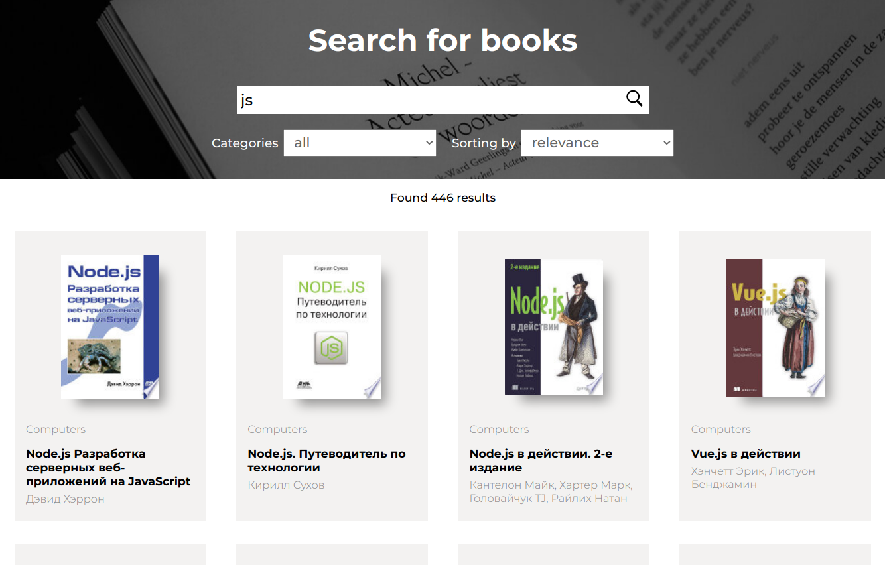
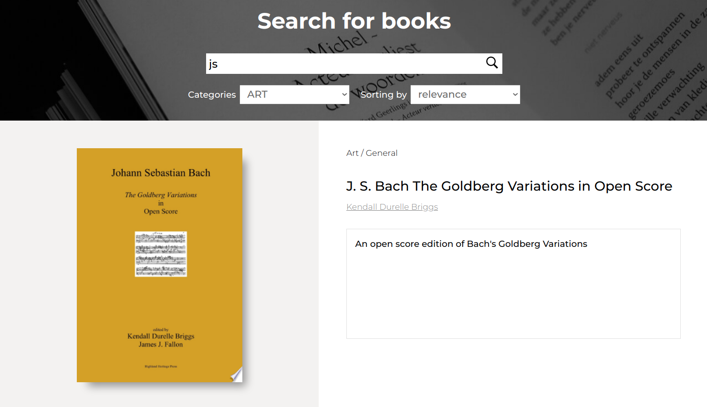

# Тестовое задание в Фьюче на позицию Junior Frontend

> Задание можно посмотреть по [этой ссылке](https://github.com/fugr-ru/frontend-javascript-test-2/blob/main/README.md)

## Запуск проекта

1. Настроить `.env` по примеру ниже
2. `set -a`
3. `source .env`
4. `docker-compose up`

**Пример `.env` (убрать кавычки)**

```json
{
    "REACT_APP_GOOGLE_API"="google-api-key-here"
    "REACT_APP_GOOGLE_BOOKS_URL"="https://www.googleapis.com/books/v1/volumes"
    "REACT_APP_MAX_RESULTS"=30
}
```

## Информация о проекте

**Библиотеки:**

- `craco` - библиотека - компилятор чтобы использовать абсолютные пути (В обход eject)
  > Чтобы добавить новые импорты, необходимо в tsconfig.path.json и craco.config.json добавить новый импорт (см. примеры в файлах). Чтобы новые импорты начали работать в скомпиленом проекте, необходимо его полностью перезапустить.

**Как тестировал**

- Ручное тестирование. Не хватило бы времени написать тесты с jest, puppeteer или cypress. Использовал браузерные расширения React Develper Tools, Redux DevTools, ~~Mobx Developer Tools~~, панель разработчика (сеть, логи), Postman.

**Известные ошибки**

- Ответ по запросу приходит partial, книги одинаковые но textSnipper отличается, как и etag, поэтому книги **повторяются**.
  > Был вариант сделать группу книг, но тогда не выходит 30 книг в ответе и пришлось бы делать тонну запросов чтобы сформировать хотя-бы первую пачку из 30 книг.
- Каждый раз меняется количество подходящих книг с каждый запросом `load more`.
  > Есть идея зафиксировать текущее значение при первом запросе.
- Indicate whether to send a cookie in a cross-site request by specifying its SameSite attribute.
  > Не `https` подключение.

## Если не подгружается или доступ закрыт, то вот описание задания:

**Функционал**

- Должны быть текстовое поле и кнопка поиска. По введенной пользователем подстроке производится поиск книг. Триггером к поиску является либо нажатие Enter (когда текстовое поле в фокусе), либо нажатие кнопки поиска.
- Фильтрация по категориям. Ниже текстового поля располагается селект с категориями: all, art, biography, computers, history, medical, poetry. Если выбрано "all" (выбрано изначально), то поиск производится по всем категориям.
- Сортировка. Рядом с селектом категорий находится селект с вариантами сортировки: relevance (выбран изначально), newest.
- Найденные книги отображаются карточками, каждая из которых состоит из изображения обложки книги, названия книги, названия категории и имен авторов. Если для книги приходит несколько категорий, то отображается только первая. Авторы отображаются все. Если не приходит какой-либо части данных, то вместо нее просто пустое место.
- Над блоком с карточками отображается количество найденных по запросу книг.
- Пагинация реализована по принципу 'load more'. Ниже блока с карточками находится кнопка 'Load more', по клику на нее к уже загруженным книгам подгружаются еще. Шаг пагинации - 30.
- При клике на карточку происходит переход на детальную страницу книги, на которой выводятся ее данные: изображение обложки, название, все категории, все авторы, описание.

**Замечания**

- **Обязательно** использование Redux/MobX.
- **Желательно** Typescript
- Во время загрузки книг стоит показать какой-то индикатор
- Использование сторонних библиотек будет плюсом только в случае если это оправданно и вы сможете объяснить причину выбора. Показав свои знания в грамотном применении сторонних готовых решений, вы имеете шанс повысить свою профессиональную привлекательность для нас.
- Пишите код так, как бы вы его писали в работе &mdash; внутренности задания будут оцениваться даже тщательней, чем внешнее соответствие заданию. Код должен быть организован так, чтобы его можно было заново использовать.
- Помните про обработку ошибок!
- Верстка может быть самая простая, однако она не должна ломаться при разрешениях от 320px до 1920px. Визуализацию и украшение делайте на ваш вкус. Мы не против использования [Bootstrap](http://getbootstrap.com/) или похожего UI фреймворк, но только для UI представления (нельзя использовать JS код для решения задачи, но можно использовать для оформительских эффектов (анимации и тому подобное))!

**Примерный вид приложения**

 
